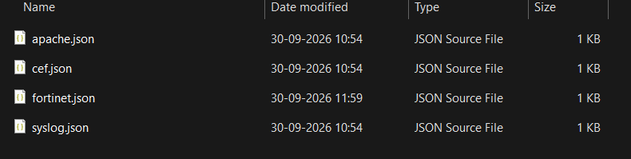
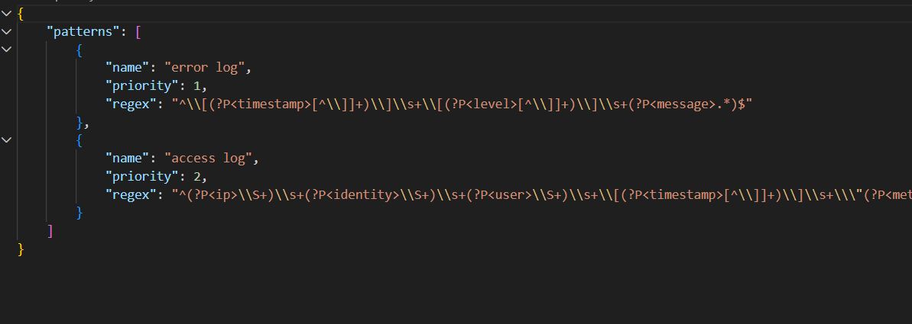
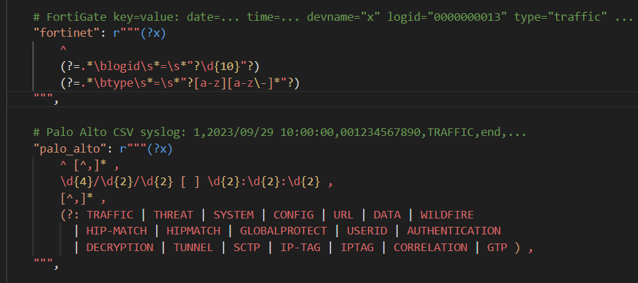
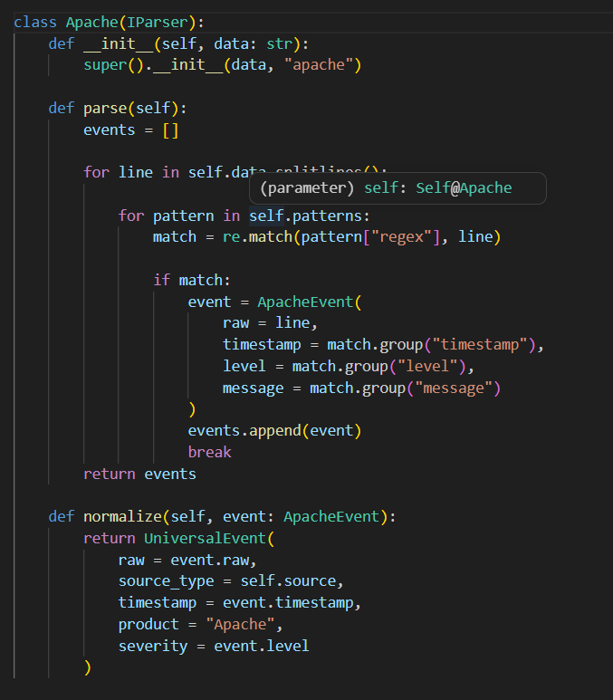
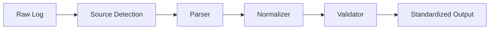
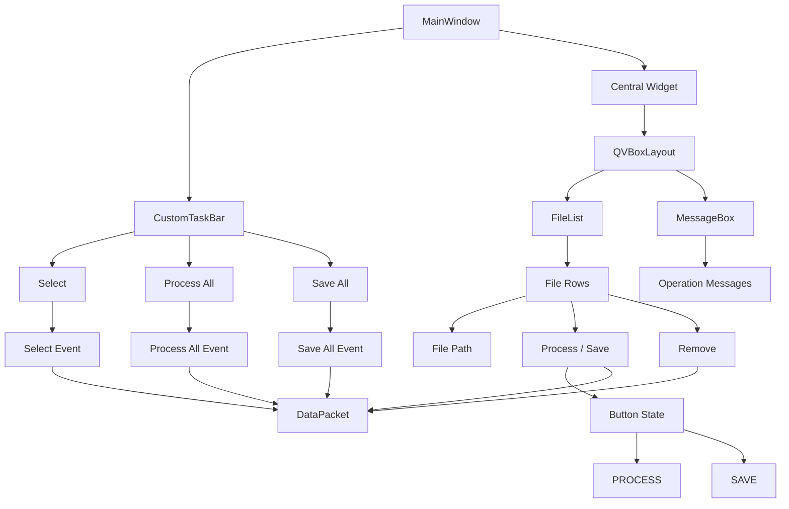
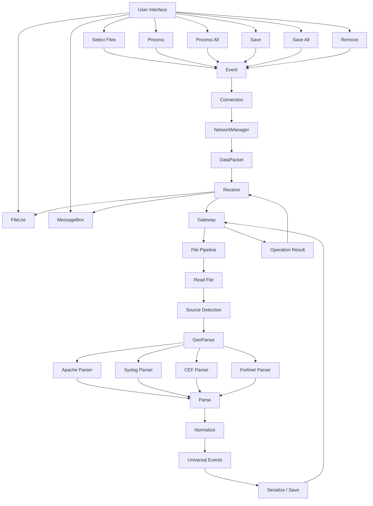

# Universal Log Pre-processing Framework

## Overview
- This project is proposed demo solution of SIH problem statement - SIH2026 PID-26156.
- It asks to create a log processing isolated program to process different log files from sources such as - Syslog, CEF, Fortinet, or from other vendors to a generalised data format which is ready to be used for SIEM or AI analytics.
- The program is purely written in python and is able to resolve the main problem of creating a generalised data format while also preserving the raw data.

## Features
- Currenlty, this program supports 4 parsers - Apache, Syslog, CEF, Fortinet.
- You can follow the 'running' instructions down below and can process as many log files you want.

### Scalability
- The architecture is scalable as -

    

    - inside "patterns" dir you can add the regex patterns of any log file you want in this fashion : 

    

    - remember the 'name' of this '.json' file as it will be used as the 'source' keyword for the whole program.

    - inside 'process/file_catg.py' file you can add the regex for log file detection by yourself.

    

    - you can further add parser of your choice inside 'parsers/parser.py' file.

    

    **In this way you can add lot of log file - detection, pattern matching, parser in less time and complexity.**

- The program follows the strict pipeline - 
    - read log file in memory
    - detect log file type
    - parse log file 
    - normalize log file into 'Universal Events' (data format)
    - write derived data of the generalised data format into 'output' dir.

- There are few sample log files and also the credit of their source is mentioned in the repository.
- All the converted log file data are stored into 'output' dir in the 'jsonl' format.
- A simple GUI has been implemented for more user friendly experience.

## Architecture

### Block Diagram

    **File pipelining**



    **UI pipelining**



    **Full Architecture**



## Installation
- git clone this repo or,
- download the zip file and extract it.

## Running
inside the terminal run the program exactly in this format
```
python main.py
```

## Future Improvements
Currently, the presentable program is in early development so the following features have been decided to add in the later developments -
- switching to Dockerfile for complete air gapped environment
- improvising the "patterns/" dir to also include the detection regexes for larger scalability and so the program will be inherently independent from the user process